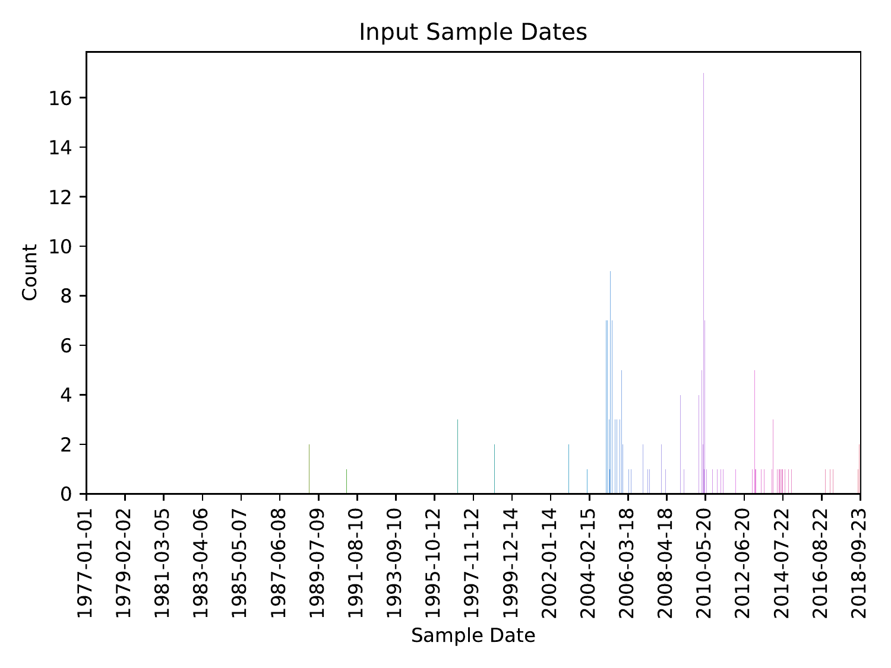

# ViReport v0.0.1 &mdash; 2020-05-11

## Input Dataset
The analysis was conducted on a dataset containing 282 sequences. The average sequence length was 14982.543, with a standard deviation of 2555.171. The earliest sample date was 1977-01-01, the median sample date was 2009-01-01, and the most recent sample date was 2018-10-01.

<figure>

<figcaption>Distribution of input sequence lengths</figcaption>
</figure>

<figure>

<figcaption>Distribution of input sample dates</figcaption>
</figure>

## Preprocessed Dataset
The input dataset was preprocessed such that sequences were given safe names: non-letters/digits in sequence IDs were converted to underscores. After preprocessing, the dataset contained 282 sequences. The average sequence length was 14982.543, with a standard deviation of 2555.171. The earliest sample date was 1977-01-01, the median sample date was 2009-01-01, and the most recent sample date was 2018-10-01.

<figure>

<figcaption>Distribution of preprocessed sequence lengths</figcaption>
</figure>

<figure>

<figcaption>Distribution of preprocessed sample dates</figcaption>
</figure>

## Multiple Sequence Alignment
Multiple sequence alignment was performed using MAFFT (Katoh & Standley, 2013) in automatic mode. There were 19811 positions (9741 invariant) and 232 unique sequences in the multiple sequence alignment. Pairwise distances were computed from the multiple sequence alignment using the tn93 tool of HIV-TRACE (Pond et al., 2018). The average pairwise sequence distance was 0.11, with a standard deviation of 0.238.

<figure>

<figcaption>Distribution of pairwise sequence distances</figcaption>
</figure>

Across the positions of the multiple sequence alignment, the minimum coverage was 0.00355, the maximum coverage was 0.986, and the average coverage was 0.756, with a standard deviation of 0.366.

<figure>

<figcaption>Coverage (proportion of non-gap characters) across the positions of the multiple sequence alignment</figcaption>
</figure>

 Across the positions of the multiple sequence alignment that had non-zero Shannon entropy, the minimum Shannon entropy was 0.0344, the maximum Shannon entropy was 1.572, and the average Shannon entropy was 0.322, with a standard deviation of 0.234.

<figure>

<figcaption>Shannon entropy across the positions of the multiple sequence alignment. A significance threshold was computed using Tukey's Rule: 1.5x the interquartile range added to the third quartile, which was 0.677. The significance threshold is shown as a red dashed line, and significant points are shown in red.</figcaption>
</figure>

## Phylogenetic Inference
A maximum-likelihood phylogeny was inferred using IQ-TREE (Nguyen et al., 2015) in ModelFinder Plus mode (Kalyaanamoorthy et al., 2017). The inferred phylogeny was MinVar-rooted using FastRoot (Mai et al., 2017).

<figure>

<figcaption>Rooted phylogenetic tree in unit of expected per-site mutations</figcaption>
</figure>

Pairwise distances were computed from the phylogeny using TreeSwift (Moshiri, 2020). The maximum pairwise phylogenetic distance (i.e., tree diameter) was 3.0553, and the average pairwise phylogenetic distance was 0.286, with a standard deviation of 0.814.

<figure>

<figcaption>Distribution of pairwise phylogenetic distances</figcaption>
</figure>

